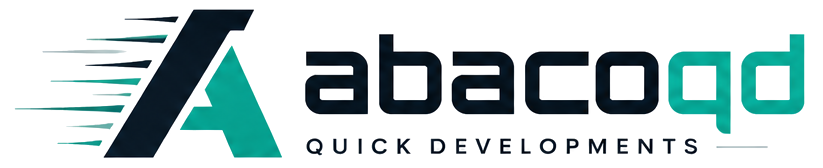

<p align="center">
  
</p>

<h1 align="center">AbacoQD — Sitio web corporativo y plataforma administrable</h1>

<p align="center">
  Web corporativa moderna para AbacoQD / Abaco Developments, construida con Laravel, Inertia, React y TypeScript.
</p>

<p align="center">
  
  
  
  
  
  
  
</p>

---

## Visión general

AbacoQD es una web corporativa profesional pensada para presentar servicios de desarrollo a medida, proyectos, metodología de trabajo, blog, contacto y reserva de citas desde una experiencia rápida, clara y visualmente cuidada.

El proyecto se ha construido desde cero sobre una arquitectura Laravel + Inertia + React, con una base preparada para contenido editable, SEO, multilenguaje, administración privada, formularios reales y despliegue en producción.

El objetivo principal es comunicar una propuesta clara: desarrollo digital rápido, moderno, seguro y adaptado a cada cliente, apoyado en herramientas actuales y en una estructura técnica mantenible.

---

## Estado del proyecto

| Dato | Valor |
| --- | --- |
| Rama principal | `main` |
| Dominio de producción | `https://abacoqd.com` |
| Estado | Sitio desplegado y en fase de cierre/optimización |
| Runtime principal | PHP 8.4+ |
| Frontend | React 19 + TypeScript + Tailwind CSS 4 |
| Backend | Laravel 13 + Inertia |
| CI | GitHub Actions con tests PHP 8.4/8.5 y control de calidad |

---

## Funcionalidades principales

### Web pública

- Landing corporativa con hero visual avanzado.
- Sección de metodología / proceso de trabajo.
- Servicios con contenido dinámico y páginas preparadas para detalle.
- Proyectos y colaboraciones gestionables.
- Página de quiénes somos.
- Blog editorial con destacados en la landing.
- Formularios de contacto y reserva.
- Páginas legales: aviso legal, privacidad y cookies.
- Páginas de error personalizadas.
- Modo claro, oscuro y sistema.
- Experiencia responsive y accesible.

### Administración

- Dashboard privado.
- Gestión de servicios.
- Gestión de proyectos.
- Gestión de partners/clientes/colaboradores.
- Gestión de reseñas.
- Gestión de posts, categorías y tags.
- Gestión de mensajes de contacto.
- Gestión de reservas.
- Gestión de usuarios y roles.
- SEO y configuración global preparada para edición.

### Comunicación y formularios

- Contacto persistido en base de datos.
- Reserva con sistema propio de citas.
- Notificaciones por email con plantillas HTML corporativas.
- SMTP preparado para producción.
- Reply-To correcto en formularios para responder al remitente real.

---

## Stack técnico

| Capa | Tecnología | Uso |
| --- | --- | --- |
| Backend | Laravel 13 | Aplicación principal, rutas, controladores, modelos y administración |
| PHP | PHP 8.4+ | Runtime de producción y CI |
| Frontend | React 19 | Interfaz pública y privada mediante Inertia |
| Adapter | Inertia.js 3 | Comunicación Laravel ↔ React |
| Tipado | TypeScript 5 | Frontend tipado |
| CSS | Tailwind CSS 4 | Sistema visual y componentes |
| Bundler | Vite 8 | Desarrollo y build de assets |
| UI | Radix UI + componentes propios | Accesibilidad y patrones reutilizables |
| Animación | Three.js, GSAP, Swiper | Hero, microinteracciones y carruseles controlados |
| Testing | Pest, PHPStan, Pint, ESLint, TypeScript | Calidad, análisis estático y validaciones |
| Base de datos | SQLite local / MySQL producción | Desarrollo local y despliegue en hosting |

---

## Arquitectura general

```text
Laravel 13
  ├─ Rutas públicas y privadas
  ├─ Controladores públicos
  ├─ Controladores admin
  ├─ Modelos de contenido
  ├─ Seeders de contenido base
  ├─ Mailables y notificaciones
  └─ SEO / settings / soporte

Inertia.js
  └─ Puente entre backend Laravel y vistas React

React 19 + TypeScript
  ├─ Páginas públicas
  ├─ Panel de administración
  ├─ Componentes reutilizables
  ├─ Layouts
  ├─ Hooks
  └─ Sistema de idioma / tema

Tailwind CSS 4 + Vite 8
  └─ Build moderno, rápido y optimizado para producción
```

---

## Estructura del proyecto

```text
app/
  Http/
    Controllers/
      Public/              # Vistas públicas: home, servicios, proyectos, contacto, reserva...
      Admin/               # Panel de administración
    Requests/              # Validaciones de formularios y CRUDs
    Middleware/            # Seguridad, Inertia, headers y control de acceso
  Mail/                    # Emails corporativos
  Models/                  # Entidades del dominio
  Support/                 # Servicios auxiliares, settings, SEO y utilidades

database/
  migrations/              # Esquema de base de datos
  seeders/                 # Datos base del sitio
  factories/               # Factories para tests y desarrollo

resources/
  js/
    pages/                 # Páginas Inertia/React
    components/            # Componentes compartidos
    layouts/               # Layouts públicos y privados
    hooks/                 # Hooks reutilizables
  views/                   # Blade base y plantillas de email

public/
  assets/                  # Branding, logos y assets estáticos
  uploads/                 # Imágenes públicas versionadas cuando aplica

docs/                      # Documentación funcional, técnica y de producto
routes/                    # Rutas web, auth y settings
tests/                     # Tests Feature y Unit
```

---

## Modelo de contenido

El proyecto está preparado para una web real y administrable. Las entidades principales son:

- `Setting` — configuración global, datos de marca, contacto, SEO y legales.
- `PageSection` / `SectionBlock` — control flexible de secciones públicas.
- `Service` — servicios ofrecidos por AbacoQD.
- `Project` — proyectos, casos y trabajos publicables.
- `Partner` — clientes, colaboradores, proveedores o entidades relacionadas.
- `Review` — reseñas asociables o independientes.
- `Post`, `PostCategory`, `Tag` — blog editorial.
- `TeamMember` — equipo publicable.
- `ContactMessage` — mensajes recibidos desde contacto.
- `AppointmentDay`, `AppointmentSlot`, `AppointmentBooking` — sistema propio de reserva.
- `SeoMetadata` — SEO por página o entidad.

---

## Puesta en marcha local

### Requisitos

- PHP 8.4 o superior.
- Composer 2.
- Node.js 22 o superior recomendado.
- npm 10 o superior.
- SQLite para desarrollo local o MySQL/MariaDB si se quiere replicar producción.

### Instalación

```bash
git clone https://github.com/kampexiii/abacoqd.git
cd abacoqd
composer install
npm install
cp .env.example .env
php artisan key:generate
```

Con SQLite en local:

```bash
touch database/database.sqlite
php artisan migrate --seed
```

### Ejecución en desarrollo

```bash
composer run dev
```

Esto levanta Laravel, la cola y Vite de forma conjunta.

También puede ejecutarse por separado:

```bash
php artisan serve
npm run dev
php artisan queue:listen --tries=1
```

---

## Comandos útiles

```bash
composer test              # Pint + PHPStan + Pest
npm run types:check        # TypeScript sin emitir build
npm run lint:check         # ESLint
npm run build              # Build de producción
php artisan optimize:clear # Limpiar cachés de Laravel
php artisan migrate --seed # Ejecutar migraciones y seeders
```

---

## Validaciones de calidad

El proyecto usa varias capas de control antes de considerar un cambio listo:

- Pint para formato PHP.
- PHPStan/Larastan para análisis estático del backend.
- Pest para tests de aplicación.
- TypeScript para tipado frontend.
- ESLint para calidad del frontend.
- Build Vite para validar assets de producción.
- GitHub Actions para ejecutar checks en remoto.

---

## Despliegue

El despliegue está preparado para Hostinger con estructura separada:

```text
~/domains/abacoqd.com/
  public_html/      # carpeta pública del dominio
  abacoQD/          # aplicación Laravel fuera de public_html
```

La carpeta pública real es `public_html`. El proyecto Laravel vive fuera de la raíz pública y solo expone los assets necesarios.

Reglas importantes de producción:

- No subir `.env` al repositorio.
- No versionar credenciales reales.
- Mantener `APP_ENV=production` y `APP_DEBUG=false`.
- Ejecutar build antes de sincronizar assets.
- Limpiar cachés tras desplegar cambios de configuración.
- Mantener la base de datos y `storage` fuera de operaciones destructivas.

---

## Seguridad y buenas prácticas

- Variables sensibles fuera de Git.
- Cabeceras de seguridad preparadas.
- CSP en modo report-only como base de endurecimiento progresivo.
- Formularios protegidos con CSRF, validación servidor y honeypot/rate limit cuando aplica.
- Emails con remitente corporativo y Reply-To del usuario.
- Panel privado con autenticación y roles.
- Separación entre contenido público, administración y configuración.

---

## Documentación

La documentación funcional y técnica vive en `docs/` y se organiza como fuente de verdad del proyecto:

- Brief y alcance.
- Modelo de datos.
- SEO, multilenguaje y legal.
- Identidad visual y componentes.
- Arquitectura del admin.
- Backlog y roadmap.
- Vistas públicas y privadas.
- Auditorías y cierres técnicos.

---

## Criterios de trabajo

Este repositorio prioriza:

- Cambios pequeños, revisables y bien justificados.
- Código limpio, modular y mantenible.
- No tocar hero, landing, migraciones o datos críticos sin motivo claro.
- No publicar datos demo como reales.
- No versionar secretos, credenciales ni información sensible.
- Mantener coherencia visual, técnica y documental.

---

## Autoría y contacto

Proyecto desarrollado y mantenido por **Pablo Sevillano Aparicio** para AbacoQD / Abaco Developments.

Repositorio principal: `kampexiii/abacoqd`.
